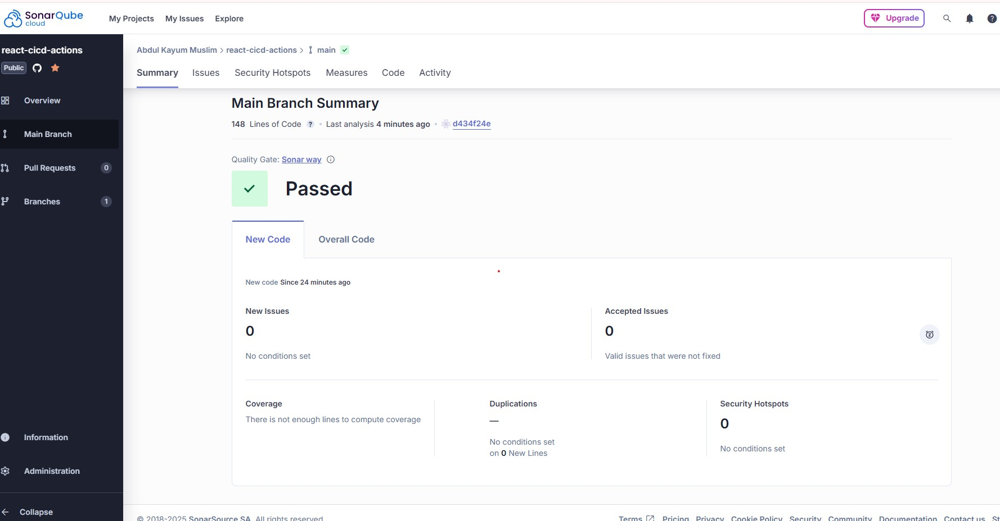
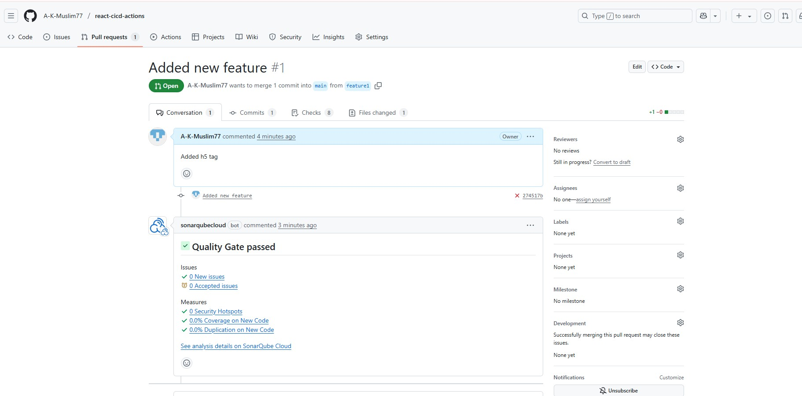
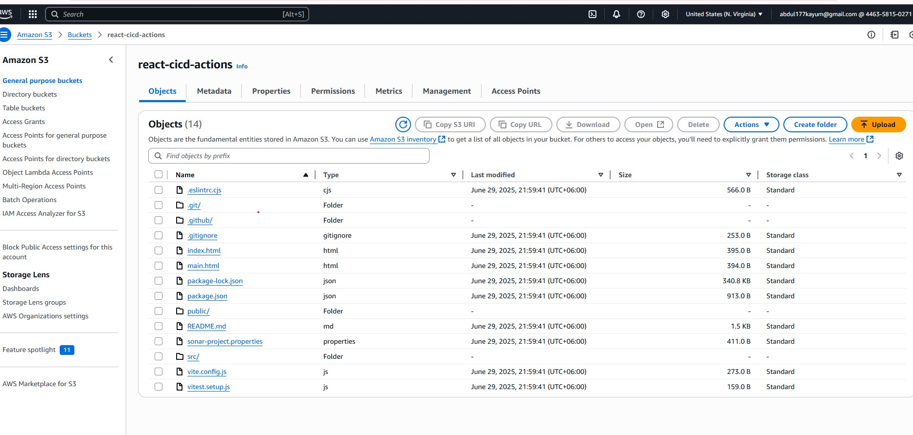
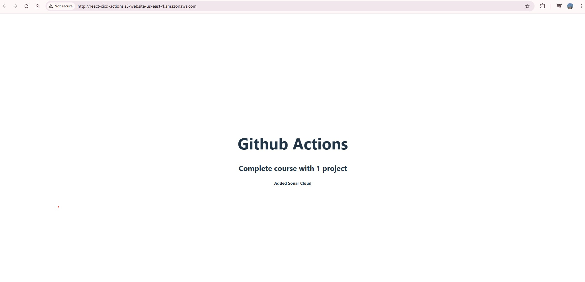

# 🚀 React CI/CD Actions

A simple React project integrated with GitHub Actions for a complete CI/CD pipeline including testing, build, artifact upload, and deployment to GitHub Pages.

## 🔗 Live Demo

🌐 [View Project on GitHub Pages](https://a-k-muslim77.github.io/react-cicd-actions)

---

## 🛠️  Setup Instructions

1. Clone the repository
   ```bash
   git clone https://github.com/A-K-Muslim77/react-cicd-actions.git
   cd react-cicd-actions
2. Install dependencies:
   ```bash
   npm install
3. Start development server
   ```bash
   npm start
4. Run Tests
    ```bash
    npm test
   
---

## 📌 Features

- ✅ React app built with Create React App
- ✅ CI/CD pipeline with GitHub Actions
- ✅ Automated testing
- ✅ Build and artifact upload
- ✅ Deployment to GitHub Pages
- ✅ SonarCloud integration for code quality analysis

---

## ⚙️ Tech Stack

- **Frontend:** React.js
- **CI/CD:** GitHub Actions
- **Deployment:** GitHub Pages

---

## 📦 CI/CD Workflow Summary

| Stage     | Tool           | Description                                |
|-----------|----------------|--------------------------------------------|
| ✅ Test    | `npm test`     | Run automated tests                        |
| 🏗️ Build  | `npm run build`| Create production build                    |
| 📁 Upload | GitHub Actions | Upload `build/` folder as artifact         |
| 🚀 Deploy | GitHub Pages   | Deploy app to GitHub Pages via Actions     |

GitHub Actions Workflow File: `.github/workflows/deployDist.yml`

---

### 🧪 SonarCloud Integration



*Figure: SonarCloud code quality report integration in the CI/CD pipeline.*

---


### 🧪 Quality_Gate



*Figure: Quality_Gate in the CI/CD pipeline.*

---


### 🧪 S3_Bucket



*Figure: S3_Bucket in the CI/CD pipeline.*

---


### 🧪 AWS_S3_Output



*Figure: AWS_S3_Output in the CI/CD pipeline.*

---


